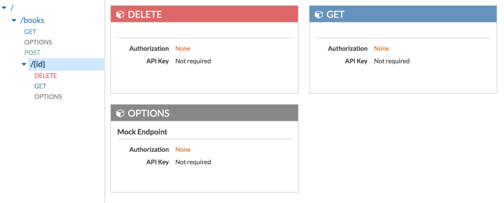

# Library api deployed to AWS using serverless

An AWS api that inserts books into a dynamoDb table. The api is deployed using the [serverless](https://serverless.com/) framework. Also the api functions integrate with the twilio service to send sms messages when a new book is submited or deleted. 

## Basic operations:

1. Submit book - receives a .json to include a book and sends a sms. .json format:
	
	```json
	{
	  "bookauthor" : "Author Name",
	  "bookgenre" : " Book genre",
	  "booktitle" : "Book title" 
	} 
	```

2. List all books - returns a .json with book information

3. List a book by id - receives the book id to list

4. Delete a book by id - receives the book id to delete and sends sms

## File list:

- sample-books.json: Sample book list to be passed to the submit function

**Source code:**

- book-submit.js: Post a book function
- book-listall.js: Get all books function
- book-listById.js: Get a book function
- book-delete.js: Delete function

**Serverless config:**

- serverless.yml: config file to deploy api library to AWS.

## API in AWS

### Books methods


### Books\\{id} methods


